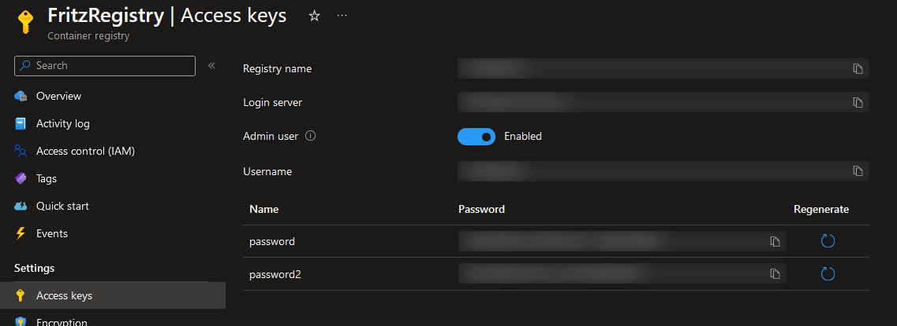

As part of a demo to show a complete interconnected .NET ecosystem from IoT to the Cloud, I am building a demo with:

- Raspberry Pi 3b (ARM32 processor, Wifi, 4GB RAM)
- Touchscreen case from SmartPi-Touch - https://smarticase.com/products/smartipi-touch-2
- Azure Container Registry
- GitHub Repository
- GitHub action
- Docker
- Docker-Compose
- .NET 7 / ASP.NET Core / SignalR Core

This combination allows our Raspberry Pi device to build from the cloud, take updates and restart the processes to present them automatically.  The process flow looks like this:

  1. An update is committed to the GitHub repository for the `demopi` application
  1. A GitHub action is triggered from the update and rebuilds the application
  1. The GitHub action publishes an updated container image to an Azure Container Registry
  1. A service called `watchtower` on the Raspberry Pi scans for an updated image and finds it in the Azure Container Registry
  1. Watchtower downloads and redeploys the running image 

## Step 0: Configure an Azure Container Registry

I already have one of these at `fritzregistry.azurecr.io`.  It was easy enough to configure and deploy with credentials required to access the content.

## Step 1: Configured Docker on the Raspberry Pi

These instructions originally appeared at: https://raspberrytips.com/docker-on-raspberry-pi/

I downloaded Docker with this command when running as root:

```bash
curl -sSL https://get.docker.com | sh   
```

I then added myself to the `docker` group by running this as my standard user `jfritz`:

```bash
sudo usermod -aG docker $USER
```

To get connected with the Azure registry, I logged in with this command and specified the registry name, the user id and password displayed on the **Access Keys** panel:



```bash
docker login
```

This generated a `/home/.docker/config.json` file that will be used to login to my private Azure registry.

## Step 2: Configured Docker-compose

Let's configure docker-compose, a tool that lets us submit several commands and configuration options at once for docker to run one or more containers.

Installed prerequisites with:

```bash
sudo apt-get install libffi-dev libssl-dev
sudo apt install python3-dev
sudo apt-get install -y python3 python3-pip
```

Installed with:

```bash
sudo pip3 install docker-compose
```

## Step 3: Configure Watchtower

[Watchtower](https://containrrr.dev/watchtower/) is a container that will watch other containers and gracefully update them when updates are available.  I grabbed the watchtower image for ARM devices using this command:

```bash
docker pull containrrr/watchtower:armhf-latest
```

I built a `docker-compose.yml` file with my desired watchtower configuration:

```yml
version: "3"
services:
  watchtower:
    image: containrrr/watchtower:armhf-latest
    volumes:
      - /var/run/docker.sock:/var/run/docker.sock
      - /jfritz/.docker/config.json:/config.json
    command: ["--interval", "30", "--cleanup"]
    restart: always
```

The two volumes allow watchtower to:

 1. Connect to the Docker service and interact with it
 2. Grab the docker registry credentials so that it can download updates to the containers

The `command` argument instructs watchtower to check for updated images every 30 seconds, and the `restart` argument instructs the container to start at startup and always restart when the watchtower stops

## Step 4 : Customize the Dockerfile to build for ARM32

The device we're using is a Raspberry Pi 3B and has an ARM32 processor.

Our new dockerfile for ARM is called `Dockerfile-ARM32` and looks like this:

```dockerfile
FROM --platform=$BUILDPLATFORM mcr.microsoft.com/dotnet/sdk:8.0-preview-alpine AS build
ARG TARGETARCH
WORKDIR /source

# copy csproj and restore as distinct layers
COPY Fritz.DemoPi/*.csproj .
RUN dotnet restore -a $TARGETARCH

# copy everything else and build app
COPY Fritz.DemoPi/. .
COPY .git/. .git/.
RUN dotnet publish -a $TARGETARCH --no-restore -o /app


# final stage/image
# .NET 8 tag includes `-preview`
FROM mcr.microsoft.com/dotnet/aspnet:8.0-preview-alpine

# These ENVs are only needed because the sample uses .NET 7
ENV DOTNET_ROLL_FORWARD=Major
ENV DOTNET_ROLL_FORWARD_PRE_RELEASE=1

WORKDIR /app
COPY --from=build /app .

USER $APP_UID
ENTRYPOINT ["./Fritz.DemoPi"]
```

There's an interesting bit in the middle where I copied in the `.git` folder.  This allows my application to grab the latest git SHA hash as a bit of a version check for the source code.  That SHA is made availalble on the assembly's `AssemblyInformationalVersionAttribute` attribute value.

We can then build the container for the Pi using this command:

```bash
docker build --platform linux/arm -f .\Fritz.DemoPi\Dockerfile-ARM32 . /
  -t fritz.demopi:4 / 
  -t fritz.demopi:latest /
  -t fritzregistry.azurecr.io/fritz.demopi:4 /
  -t fritzregistry.azurecr.io/fritz.demopi:latest
```

and then push to my remote registry with:

```bash
 docker push fritzregistry.azurecr.io/fritz.demopi -a
```

## Step 5: Configure Docker on the Pi to run the website

By default ASP.NET Core configured port 8080 for the website inside the container.  I wrote a quick `docker-compose.yml` script with all of the configuration I would need to run my application:

```yml
version: "3"
services:
  demopi:
    image: fritzregistry.azurecr.io/fritz.demopi:latest
    volumes:
      - type: bind
      - source: /home/jfritz/demopo/ClickCount.csv
      - target: /app/ClickCount.csv
    ports:
	  - "80:8080"
	restart: always
```


To ensure that the SignalR bits of my demo would work, I removed a privacy extension from the Chromium browser that comes with the Raspberry Pi device.

## Step 6:  Configure the Pi to boot into Chromium for the website

I added a file at `~/.config/lxsession/LXDE-pi` called `autostart` with this configuration:

```
@lxpanel --profile LXDE-pi
@pcmanfm --desktop --profile LXDE-pi
#@xscreensaver -no-splash
point-rpi
@chromium-browser --start-fullscreen --start-maximized http://localhost/
```

Additional options and the instructions I started with are at https://smarthomepursuits.com/open-website-on-startup-with-raspberry-pi-os/?expand_article=1

## Step 7: Prepare a GitHub action

I configured a GitHub action to checkout my code and build with the Dockerfile established previously:

```yml
name: Docker Image CI

on:
  push:
    branches: [ "main" ]
  pull_request:
    branches: [ "main" ]

jobs:

  build:

    runs-on: ubuntu-latest

    steps:
    - uses: actions/checkout@v3
    - name: Set up QEMU
      uses: docker/setup-qemu-action@v2
    - name: Login to Docker Hub
      uses: docker/login-action@v2
      with:
        registry: fritzregistry.azurecr.io
        username: ${{ secrets.REGISTRY_USERNAME }}
        password: ${{ secrets.REGISTRY_TOKEN }}    
    - name: Build the Docker image
      run: docker build --platform linux/arm --file Fritz.DemoPi/Dockerfile-ARM32 --tag fritzregistry.azurecr.io/fritz.demopi:$(date +%s) --tag fritzregistry.azurecr.io/fritz.demopi:latest .
    - name: Push the Docker image
      run: docker push fritzregistry.azurecr.io/fritz.demopi -a
```

Success!

## Summary

As changes are made to the GitHub repository, the GitHub action will rebuild the image and deploy it to the Azure Container Registry.  Watchtower identified the update and automatically stops the existing application on the Pi and then deploys a new copy with the same settings.  With a little SignalR work, the UI updates seamlessly.